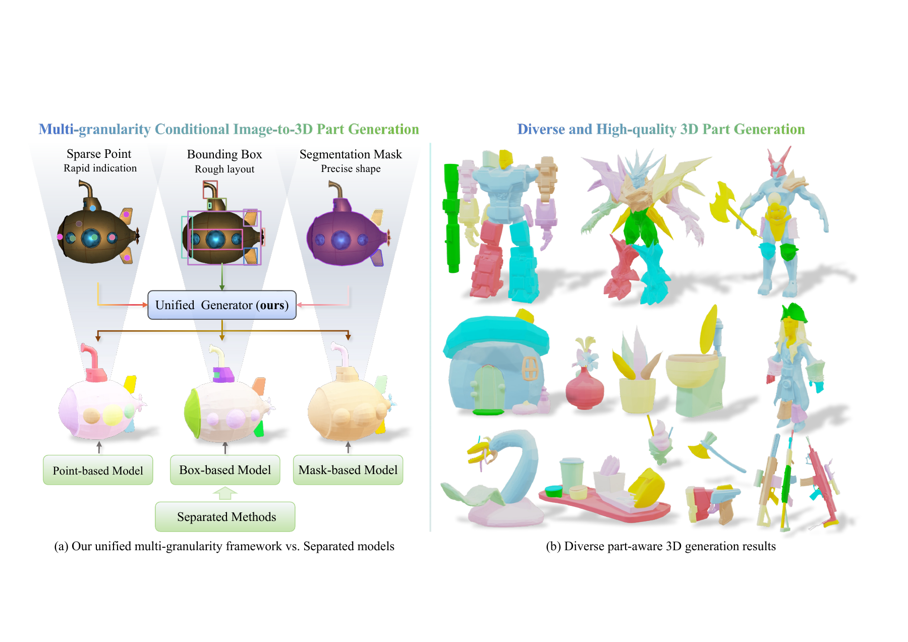
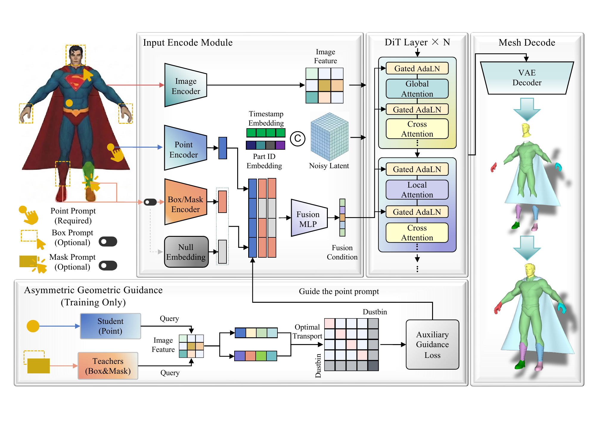
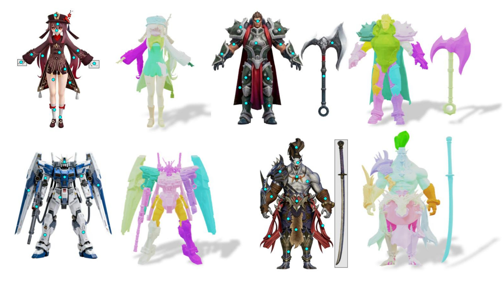

# FlexPart: A Unified Framework for Image-to-3D Part Generation via Variable Granularity

<div align="center">

**Qiwen Gu · Xin Zhou · Xiwu Chen · Zhongyang Zhu · Zhuo Zhang · Junqiao Zhao**

[](https://huggingface.co/gucci233/FlexPart)


</div>

Official implementation of **A Unified Framework for Image-to-3D Part Generation via Variable Granularity**.

FlexPart generates separate, assemblable 3D parts from a single image. One model supports **point, bounding-box, and segmentation-mask prompts**, so users can choose the amount of geometric control they need. Built upon [PartCrafter](https://github.com/wgsxm/PartCrafter), it combines gated adaptive modulation with asymmetric geometric guidance during training.



## Model Overview



Image features and part-level geometric prompts condition a diffusion transformer. Missing prompt modalities use learnable null embeddings. During training, asymmetric geometric guidance transfers spatial information from box and mask priors to point representations.

## Qualitative Results



Generation results on objects with complex topologies using manually annotated point or box prompts. Each example pairs the annotated input image with the generated 3D parts, shown in different colors.

## Release Status

- [x] Training and inference code
- [x] [Pretrained transformer checkpoint](https://huggingface.co/gucci233/FlexPart)
- [x] Local Gradio demo for points and boxes
- [ ] Public paper link

## Installation

The setup targets **Linux, Python 3.11, and PyTorch 2.5.1 with CUDA 12.4**. Inference and the demo require an NVIDIA GPU. GPU memory use depends on the number of parts, tokens, and mesh extraction settings.

Clone this repository and run the following commands from its root:

```bash
git clone https://github.com/Gucci233/FlexPart.git
cd FlexPart
conda create -n flexpart python=3.11
conda activate flexpart
pip install torch==2.5.1 torchvision==0.20.1 torchaudio==2.5.1 --index-url https://download.pytorch.org/whl/cu124
bash settings/setup.sh
```

Without root access, skip the script's system-package installation and install the graphics libraries with conda:

```bash
SKIP_SYSTEM_DEPS=1 bash settings/setup.sh
conda install -c conda-forge libegl libglu pyopengl
```

For headless mesh rendering, an EGL-capable graphics setup is required. If needed, set `PYOPENGL_PLATFORM=egl` before launching a script with `--render` or preprocessing meshes.

## Pretrained Weights

The released weights are hosted at [gucci233/FlexPart](https://huggingface.co/gucci233/FlexPart). The current release contains the **FlexPart transformer checkpoint**, rather than a complete pipeline directory. The VAE, DINOv2 image encoder, image processor, and scheduler come from [TripoSG](https://huggingface.co/VAST-AI/TripoSG).

Assemble a local pipeline with:

```bash
python scripts/prepare_weights.py --output_dir ./weight/FlexPart
```

This downloads the transformer and the required TripoSG components, checks all transformer tensor names and shapes against `configs/flexpart_inference.json`, and creates:

```text
weight/FlexPart/
├── model_index.json
├── transformer/
│   ├── config.json
│   └── diffusion_pytorch_model.safetensors
├── vae/
├── image_encoder_dinov2/
├── feature_extractor_dinov2/
└── scheduler/
```

To reuse an existing transformer checkpoint or local TripoSG download:

```bash
python scripts/prepare_weights.py \
  --checkpoint_dir ./checkpoint \
  --base_model ./weight/TripoSG \
  --output_dir ./weight/FlexPart
```

The inference configuration uses the alternating global-attention blocks from the supplied training YAML files. Tensor validation checks parameter compatibility; it does not establish generation quality. Use `--transformer_config` if your checkpoint was trained with different settings. Choose a new output directory if an assembled pipeline already exists.

The Gradio demo also requires **RMBG-1.4** for background removal. Command-line inference only needs it when `--rmbg` is enabled:

```bash
python -c "from huggingface_hub import snapshot_download; snapshot_download(repo_id='briaai/RMBG-1.4', local_dir='./weight/RMBG-1.4')"
```

## Interactive Demo

After preparing the pipeline and RMBG weights:

```bash
python app.py
```

Open `http://127.0.0.1:7860`, upload an image, and draw points or boxes to specify parts. The demo removes the background before annotation. Results are saved to `./output_gradio/latest_result.glb`.

Override paths or the listening address when needed:

```bash
python app.py --model_path ./weight/FlexPart --rmbg_model_path ./weight/RMBG-1.4 --server_name 0.0.0.0
```

## Inference

A sample input image and seven manually selected point prompts are included. The prompts specify the body, hands, feet, and antennae; they are an illustrative input, not a benchmark annotation.

```bash
python scripts/inference_flexpart.py \
  --image_path assets/3.png \
  --point_path assets/example_points.npy \
  --model_path ./weight/FlexPart \
  --output_dir ./output_single \
  --tag example
```

For your own image, supply at least one NumPy prompt file:

```bash
python scripts/inference_flexpart.py \
  --image_path example.png \
  --mask_path mask.npy \
  --model_path ./weight/FlexPart \
  --render
```

| Argument | Description |
| --- | --- |
| `--image_path` | Input image (required) |
| `--point_path` | Numeric array `(N, 2)` with pixel coordinates `[x, y]` |
| `--box_path` | Numeric array `(N, 4)` with pixel coordinates `[x1, y1, x2, y2]` |
| `--mask_path` | Binary or numeric array `(N, H, W)`; nonzero pixels indicate foreground |
| `--model_path` | Assembled pipeline directory; default `./weight/FlexPart` |
| `--output_dir` | Output root; default `./output_single` |
| `--tag` | Output subdirectory; defaults to the input filename stem |
| `--rmbg` | Remove background while preserving image size and prompt coordinates |
| `--rmbg_model_path` | RMBG model directory; default `./weight/RMBG-1.4` |
| `--render` | Also export a rotating mesh GIF |
| `--num_tokens` | Tokens per part; default `1024` |
| `--num_inference_steps` | Sampling steps; default `50` |
| `--guidance_scale` | Guidance scale; default `7.0` |
| `--seed` | Random seed; default `2026` |

Coordinates refer to the original input image. Masks must match its dimensions and each contain foreground pixels. Save numeric arrays using `np.save`; pickled object arrays are not accepted. When providing multiple prompt types, use the same number and ordering of parts. Masks derive point and box coordinates; boxes derive center points; point-only input leaves the box and mask conditions inactive.

Outputs are written to `<output_dir>/<tag-or-image-stem>/`:

```text
part_00.glb, part_01.glb, ...   # Individual part meshes
object.glb                   # Assembled mesh
rendering.gif                # Optional, with --render
```

## Dataset Preparation

Our experiments use **PartObjaverse** and **PartVerse-XL**. See [PartCrafter's dataset instructions](https://github.com/wgsxm/PartCrafter/blob/main/datasets/README.md) for Objaverse sources and [FullPart](https://github.com/hkdsc/fullpart) for PartVerse-XL.

Prepare your raw GLB meshes using:

```bash
python datasets/preprocess/multi_preprocess.py \
  --input ./data/raw \
  --output ./data/preprocessed \
  --workers 4
```

The script writes `./data/object_part_configs_new.json`, which matches the default dataset paths in the training configurations. All input files must have unique filename stems. See [Dataset README](datasets/README.md) for the output schema and preprocessing details.

## Training

Download the **complete TripoSG model** for training initialization:

```bash
python -c "from huggingface_hub import snapshot_download; snapshot_download(repo_id='VAST-AI/TripoSG', local_dir='./weight/TripoSG')"
```

Set `model.pretrained_model_name_or_path` and `dataset.config` in the training YAML files for your data. Relative paths are resolved from the repository root. The launcher defaults to 8 GPUs; set `NUM_LOCAL_GPUS` to change this. Adjust batch size for your available memory, and authenticate W&B or set `WANDB_MODE=offline`.

### Stage 1: Up to 8 Parts, 512 Tokens per Part

```bash
bash scripts/train_partcrafter.sh \
  --config configs/mp8_nt512.yaml \
  --use_ema \
  --gradient_accumulation_steps 4 \
  --output_dir output_flexpart \
  --tag stage1_mp8_nt512
```

### Stage 2: Up to 16 Parts, 1024 Tokens per Part

```bash
bash scripts/train_partcrafter.sh \
  --config configs/mp16_nt1024.yaml \
  --use_ema \
  --gradient_accumulation_steps 4 \
  --output_dir output_flexpart \
  --load_pretrained_model stage1_mp8_nt512 \
  --load_pretrained_model_ckpt <STAGE1_ITERATION> \
  --tag stage2_mp16_nt1024
```

Replace `<STAGE1_ITERATION>` with an integer saved iteration. The checkpoint is loaded from `output_flexpart/stage1_mp8_nt512/checkpoints/<six-digit-iteration>/`.

## Evaluation

Whole-mesh evaluation uses preprocessing metadata and generated `object.glb` files. Generated subdirectory names must match the corresponding source mesh stems:

```bash
python src/eval/eval_whole.py --json_path ./data/object_part_configs_new.json --gen_root ./output_single
```

Part-level evaluation additionally requires a `pred_mesh_path` field in each metadata entry, pointing to that object's generated `object.glb`:

```bash
python src/eval/eval_part.py --json_path ./data/evaluation_annotations.json
```

These scripts consume `normalized_rotated_scene.glb` from the preprocessing output. The evaluation sample count, thresholds, and ICP alignment should be matched to the manuscript protocol before reporting benchmark results.

## Acknowledgements

We thank the authors of [PartCrafter](https://github.com/wgsxm/PartCrafter), [TripoSG](https://github.com/VAST-AI-Research/TripoSG), [FullPart](https://github.com/hkdsc/fullpart), and [TRELLIS](https://github.com/microsoft/TRELLIS) for their work and open-source resources.

## Citation

```bibtex
@misc{gu2026flexpart,
  title={A Unified Framework for Image-to-3D Part Generation via Variable Granularity},
  author={Qiwen Gu and Xin Zhou and Xiwu Chen and Zhongyang Zhu and Zhuo Zhang and Junqiao Zhao},
  year={2026}
}
```

The public paper URL and publication metadata will be added when available.

## License

This repository includes an [MIT License](LICENSE) for the project code. Third-party components retain their upstream terms: the VAE's unconditioned DiT block carries the original license in [dit_block.py](src/models/transformers/dit_block.py), with attribution in [NOTICE](NOTICE). Model weights and datasets are governed by their respective repositories' licenses.
